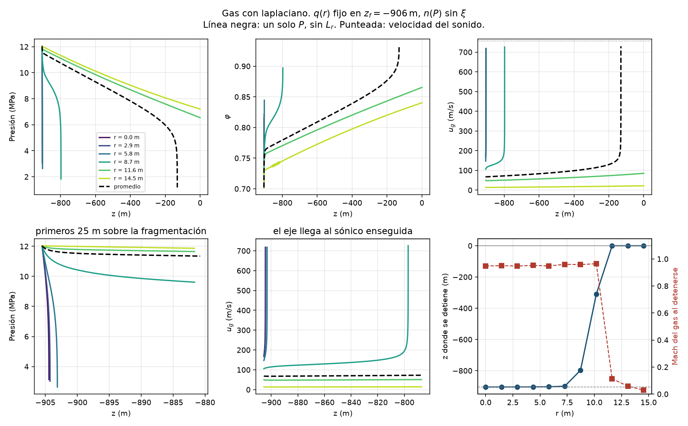
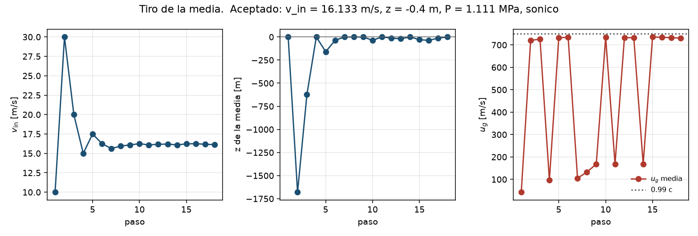
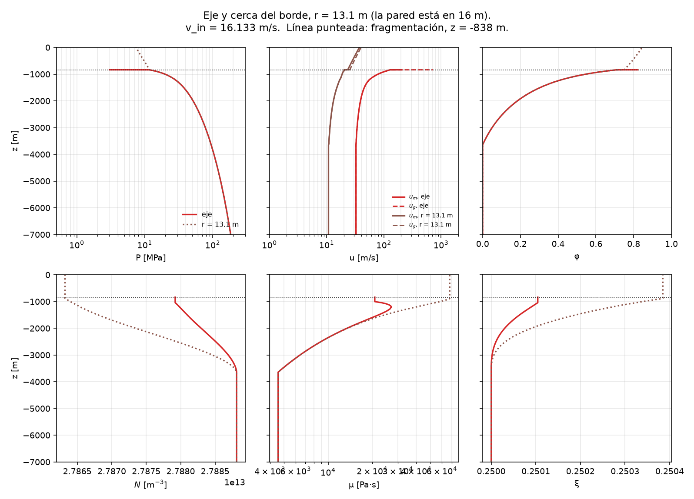
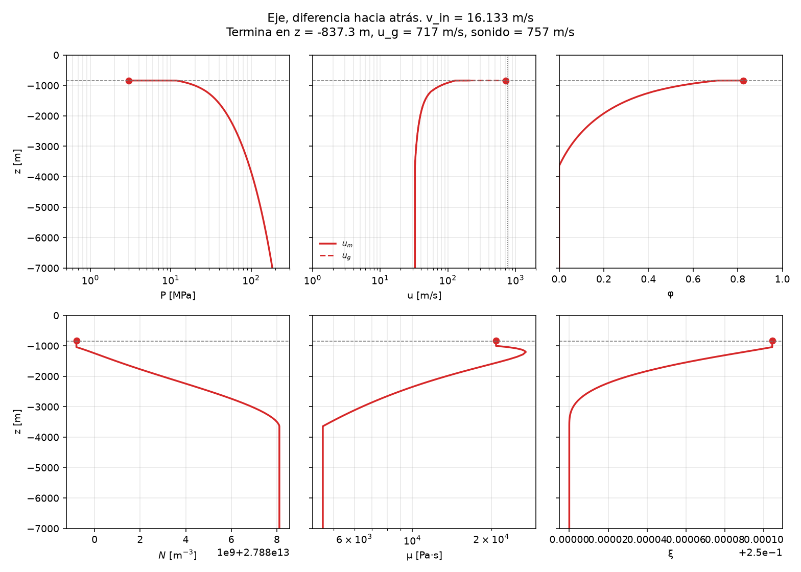
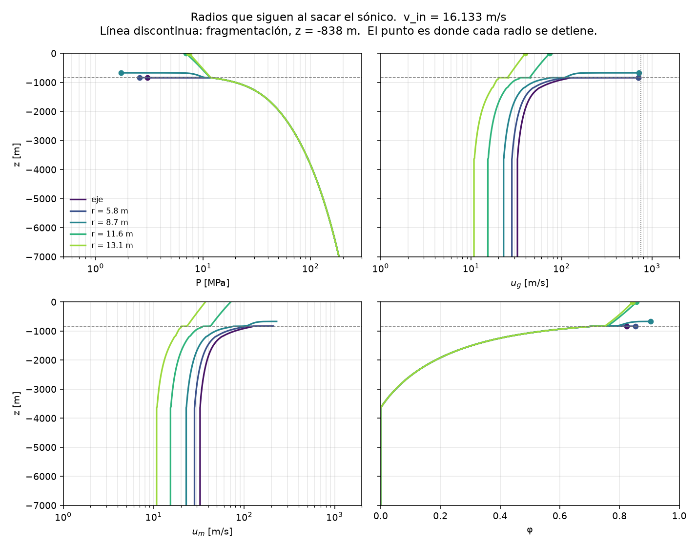

# Variantes del cierre después de la fragmentación

Bitácora del conducto 2D de Calbuco 2015. Cada sección es una variante
que ya se corrió. Las que sigan se agregan al final, con el mismo
formato: ecuaciones, qué se congeló, dónde se detuvo la marcha y la
figura.

Caso común a todas las corridas: conducto cilíndrico, radio \(R = 16\,\mathrm{m}\),
profundidad \(H = -7000\,\mathrm{m}\), \(\varphi_{\mathrm{crit}} = 0{,}7\),
\(P_{\mathrm{atm}} = 10^{5}\,\mathrm{Pa}\), \(T = 1173{,}15\,\mathrm{K}\),
cristalinidad de entrada \(\xi_0 = 0{,}25\), tiempo característico de
cristalización \(\tau_{\mathrm{car}} = 2\,\mathrm{h}\), coeficiente de
arrastre \(C = 300\,\mathrm{m}^{-1}\).

Antes de fragmentar el modelo es el mismo en todas las variantes.
La velocidad del fundido \(u_m(r)\) sale del algoritmo de Thomas
(lubricación radial). El gas va trabado, \(u_g = u_m\). La fracción
de gas es la de Henry evaluada con la cristalinidad local,

\[
\varphi = \varphi_{\mathrm{Henry}}(P, \xi),
\]

y \(\xi(r)\) y el número de burbujas \(N(r)\) se integran con la
cinética. Con \(\tau_{\mathrm{car}} = 2\,\mathrm{h}\) el ascenso dura
del orden de un minuto, así que \(\xi\), \(N\) y \(\varphi\) casi no
cambian con el radio: la presión es la misma en toda la sección y la
cristalización no alcanza a diferenciarse.

---

## 1. Promedio de sección, con \(q(r)\) de Thomas congelado

Esta es la variante de trabajo. En la fragmentación se guarda el flujo
másico de cada radio y no se vuelve a tocar:

\[
q(r) = \rho_m\,(1 - \varphi_f)\,u_{m,f} + \rho_g(z_f)\,\varphi_f\,u_{g,f}.
\]

El reparto de esa masa entre líquido y gas es la solubilidad, sin
cristales en el factor de masa del gas (los cristales quedan en el
líquido, no suspendidos en el vapor):

\[
n(P) = \frac{1}{1 + \dfrac{\rho_g(P)}{\rho_m}\left(\dfrac{1}{c_g(P)} - 1\right)}.
\]

Con el promedio de sección \(\bar q\) salen dos velocidades medias,

\[
\bar u_m = \frac{(1 - n)\,\bar q}{\rho_m\,(1 - \bar\varphi)}, \qquad
\bar u_g = \frac{n\,\bar q}{\rho_g\,\bar\varphi},
\]

y un solo par de ecuaciones para la sección,

\begin{align*}
\rho_m\,\bar u_m\,\frac{d\bar u_m}{dz}
  + \frac{dP}{dz} + \rho_m g
  - \frac{F_{mg}}{1 - \bar\varphi} &= 0, \\[4pt]
\rho_g\,\bar u_g\,\frac{d\bar u_g}{dz}
  + \frac{dP}{dz} + \rho_g g
  + \frac{F_{mg}}{\bar\varphi} &= 0,
\end{align*}

con el arrastre \(F_{mg} = C\,\varphi\,(1 - \varphi)\,(u_g - u_m)\,|u_g - u_m|\).
De ahí salen \(dP/dz\) y \(d\bar\varphi/dz\). Las velocidades puntuales
se reconstruyen con el mismo \(n\) y el \(q(r)\) congelado, así que el
perfil radial de Thomas se conserva por encima de la fragmentación.

El salto de \(u_g\) justo al fragmentar, del orden de \(1/(1 - \xi_0) = 4/3\),
aparece al pasar de la fórmula de masa con \(\xi\) (pre-fragmentación)
a la fórmula sin \(\xi\).

---

## 2. Por qué el promedio: cada radio pide otra pendiente

Si en la fragmentación se escribe el sistema \(2\times 2\) en cada
radio, con su propio \(q(r)\) y sin promediar, \(dP/dz\) deja de ser
único. Con \(v_{\mathrm{in}} = 17{,}021\,\mathrm{m/s}\) la fragmentación
queda en \(z_f = -906\,\mathrm{m}\), \(P = 12\,\mathrm{MPa}\),
\(\varphi \approx 0{,}70\):

| radio | \(q\) [\(\mathrm{kg\,m^{-2}s^{-1}}\)] | \(dP/dz\) [\(\mathrm{Pa/m}\)] |
|---|---:|---:|
| eje | \(9{,}7\times 10^{4}\) | \(-3{,}8\times 10^{6}\) |
| medio | \(6{,}0\times 10^{4}\) | \(-1{,}4\times 10^{6}\) |
| cerca de la pared | \(7{,}8\times 10^{3}\) | \(-2\times 10^{4}\) |
| promedio de sección | — | \(-5{,}8\times 10^{5}\) |

El eje lleva unas doce veces más masa que la pared, así que pide una
descompresión mucho más fuerte. Una sola \(P(z)\) no puede cumplir el
momento en todos los radios a la vez.

---

## 3. Cada radio con su propia presión

Se integró el \(2\times 2\) por radio, con \(q(r)\) congelado, \(n(P)\)
sin \(\xi\), y \(P(r, z)\), \(\varphi(r, z)\) independientes. Sustituyendo
las velocidades

\[
u_m = \frac{(1 - n)\,q(r)}{\rho_m\,(1 - \varphi)}, \qquad
u_g = \frac{n\,q(r)}{\rho_g\,\varphi}
\]

en los dos momentos, el sistema de cada radio es

\begin{align*}
\rho_m u_m \frac{du_m}{dz} + \frac{dP}{dz} + \rho_m g - \frac{F_{mg}}{1 - \varphi} &= 0, \\[4pt]
\rho_g u_g \frac{du_g}{dz} + \frac{dP}{dz} + \rho_g g + \frac{F_{mg}}{\varphi} &= 0.
\end{align*}

Resultado: el eje llega a \(u_g\) sónica a poco más de \(1\,\mathrm{m}\)
sobre la fragmentación y la marcha de ese radio se detiene. Los radios
exteriores siguen y la pared llega a la boca subsónica, con una presión
de varios megapascales. El eje se ahoga porque su \(q(0)\) es grande: el
gas se acelera hasta la velocidad del sonido en cuanto \(\varphi\) y
\(\rho_g\) empiezan a cambiar.

---

## 4. Lo mismo, con el laplaciano viscoso del gas

Se agregó al momento del gas el acoplamiento radial

\[
L_r = \frac{1}{r}\frac{\partial}{\partial r}\!\left(r\,\mu_g\,\varphi\,\frac{\partial u_g}{\partial r}\right),
\qquad \mu_g = 10^{-5}\,\mathrm{Pa\cdot s}.
\]

En la fragmentación \(|L_r|\) queda entre \(10^{-5}\) y \(10^{-3}\,\mathrm{Pa/m}\),
con un máximo del orden de \(5\times 10^{-3}\,\mathrm{Pa/m}\). Al lado de
\(dP/dz \sim 10^{6}\,\mathrm{Pa/m}\) no mueve la solución: los perfiles
con y sin \(L_r\) se superponen, y el eje se sigue ahogando al mismo metro.



---

## 5. Tiro sobre la media de la sección

El tiro busca la \(v_{\mathrm{in}}\) que deja la velocidad media del gas
sónica en la boca. Converge en

\[
v_{\mathrm{in}} = 16{,}133\,\mathrm{m/s}.
\]

La fragmentación de esa corrida queda en \(z_f \approx -838\,\mathrm{m}\).
La media llega a la boca en \(z = -0{,}44\,\mathrm{m}\) con
\(P = 1{,}11\,\mathrm{MPa}\) y \(\bar u_g = 730\,\mathrm{m/s}\).

El eje, integrado con su propio \(2\times 2\), igual se ahoga a \(\sim 1\,\mathrm{m}\)
sobre \(z_f\). El tiro arregla la condición de la sección; no le quita
masa al eje.



La columna completa, eje y radio cercano a la pared (\(r = 13{,}1\,\mathrm{m}\)),
con esa \(v_{\mathrm{in}}\):



---

## 6. Diferencias hacia atrás en el tramo fragmentado

En lugar de Euler se resolvió en cada paso el sistema implícito con
`least_squares`, paso \(h\), incógnitas \((u_m, u_g, P, \varphi)\) en el
nivel nuevo:

\begin{align*}
\rho_m\frac{u_{m,j}^{2} - u_{m,j-1}^{2}}{2h}
  + \frac{P_j - P_{j-1}}{h} + \rho_m g
  - \frac{F_{mg,j}}{1 - \varphi_j} &= 0, \\[6pt]
\rho_g\frac{u_{g,j}^{2} - u_{g,j-1}^{2}}{2h}
  + \frac{P_j - P_{j-1}}{h} + \rho_g g
  + \frac{F_{mg,j}}{\varphi_j}
  - \frac{L_{r,j}}{\varphi_j} &= 0.
\end{align*}

El paso se achica hasta \(10^{-5}\,\mathrm{m}\) cerca de la singularidad
sónica. El eje se detiene en el mismo lugar que con Euler:
\(z \approx -837{,}3\,\mathrm{m}\), \(u_g \approx 718\,\mathrm{m/s}\),
\(P \approx 3{,}0\,\mathrm{MPa}\). Cambiar el esquema no atraviesa el
choque.



---

## 7. Congelar el radio que ya es sónico y seguir con el resto

Cuando un nodo llega a \(u_g \approx c_s\) se saca del vector activo y
los demás siguen subiendo. Con la misma marcha en diferencias hacia atrás:

| radio [\(\mathrm{m}\)] | hasta dónde llega | qué queda |
|---:|---|---|
| \(0\) | \(z = -837{,}3\,\mathrm{m}\) | \(u_g \approx 710\,\mathrm{m/s}\), sónico |
| \(5{,}8\) | \(z \approx -836\,\mathrm{m}\) | sónico, un metro más arriba |
| \(8{,}7\) | \(z \approx -672\,\mathrm{m}\) | se ahoga a mitad de camino |
| \(10{,}2\) | \(z \approx -153\,\mathrm{m}\) | se ahoga cerca de la boca |
| \(11{,}6\) | boca | \(P \approx 6{,}9\,\mathrm{MPa}\), \(u_g \approx 74\,\mathrm{m/s}\) |
| \(13{,}1\) | boca | \(P \approx 7{,}4\,\mathrm{MPa}\), \(u_g \approx 40\,\mathrm{m/s}\) |

Los radios de afuera llegan a \(z = 0\) subsónicos y con varios
megapascales. Cada radio tiene su propia presión, así que la sección
deja de ser un estado termodinámico único.



---

## 8. Momento radial

Todavía no está corrida. Si \(P = P(r, z)\), entonces \(\partial_r P \neq 0\)
y aparece velocidad radial. Para no romper la masa de cada fase harían
falta dos velocidades más, \(u_{r,m}\) y \(u_{r,g}\), y la continuidad
deja de ser \(q(r)\) constante:

\[
\frac{\partial}{\partial z}(\rho\,\varphi\,u_z)
  + \frac{1}{r}\frac{\partial}{\partial r}(r\,\rho\,\varphi\,u_r) = 0.
\]

Eso son dos ecuaciones de masa y dos de momento radial, además de las
axiales. El \(q(r)\) congelado de Thomas deja de valer en cuanto hay
flujo de una corona a otra.

---

## Cómo agregar la siguiente variante

Copiar este bloque al final y llenarlo.

```
## N. Nombre corto

Qué se cambió respecto de la variante anterior.

Ecuaciones.

Corrida: v_in, z_f, dónde se detiene, P y u_g en la boca o en el corte.

Figura: tesis/figuras_variantes/<nombre>.png

Qué se concluye en una frase.
```
